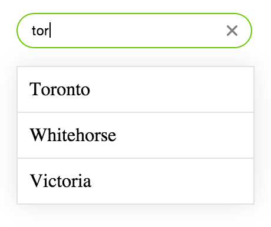

# Suggestible Input

A [React](http://facebook.github.io/react/index.html)
component for providing as-you-type suggestions when filling out an input field.



As you type text into the input field, a list of suggestions will be displayed
in a selectable overlay just below. The suggestions are an array of strings
given to the component as a prop and are compared to the ever-changing query
string that you are typing. The "closer" a suggestion is to what you have typed,
the higher in the list it will appear.

## Installation

The easiest way to use SuggestibleInput is to install it from NPM and include
it in your own React build process (e.g., using
[Browserify](http://browserify.org/) or [Webpack](http://webpack.github.io/))

`npm install suggestible-input --save`

## Usage

SuggestibleInput is a drop-in replacement for regular `<input>` tags. You can
include all the properties you would normally include on an `<input>`, plus a
few extras. It should behave as you would expect an `<input>` to behave with
the added bonus of giving users the ability to complete their text input from
a list of helpful suggestions.

The simplest way of using it is to require it, and then simply render it by
passing it an array of strings (the suggestions):

```javascript
var SuggestibleInput = require('suggestible-input');

var suggestions = [
  'Toronto',
  'Montreal',
  'Ottawa',
  'Vancouver',
  'Edmonton',
  'Calgary'
];

<SuggestibleInput suggestions={suggestions} />
```

## Styling

You can style the component any way you like by simply implementing the following
CSS classes and elements.

Element | Description
------- | -----------
.suggestible-input | The outer container of the whole component.
.suggestible-input > input | The actual input element used for entering text.
.suggestible-input-clear | A button used to clear the value of the input. It has no content itself and is intended to be given a background-image for graphics.
.suggestible-input-suggestions | A `<ul>` element which is the list of suggestions.
.suggestible-input-suggestions > li | An individual suggestion in the list.
.suggestible-input-bg | A background overlay that can be used to block, or dim, anything underneath the component while the suggestions are being shown.

There is an example CSS file in `dist/` that you can use as a starting point.

## How it works

A combination of filters get used to shorten the list of suggestions and sort
them based on a heuristic relevance.

1. Find a subset of suggestions that match what you've typed based on a simple
algorithm which finds suggestions strings that match your query string in terms
of containing the characters of the query string, in the order that they appear.

2. Rank each suggestion in the subset based on how different it is from the
query string (that is, how many edits it would take to change the suggestion
into the query string).

3. Sort the subset list based on their rankings.

4. Cut off the list at the user-defined maximum (or 10, by default).

## Settings

Option | Type | Default | Description
------ | ---- | ------- | -----------
value | string | '' | Used to set the initial value of the input.
suggestions | array | [] | An array of strings used as the source of the suggestions that are displayed.
maxSuggestions | number | 10 | The maximum number of suggestions to display at one time.
placeholder | string | '' | The value of the input's placeholder, shown when there is no value.
clearOnSelect | boolean | false | Whether or not to clear the input's value when selecting a suggestion.
onChange | function | null | Used to hook into onChange events of the input.
onKeyDown | function | null | Used to hook into onKeyDown events of the input.

## Dependencies

React >= 0.13
